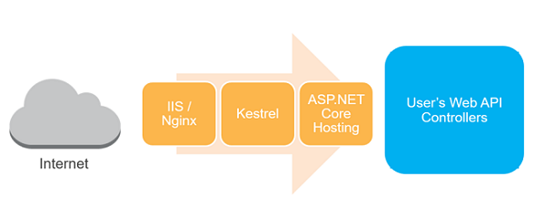
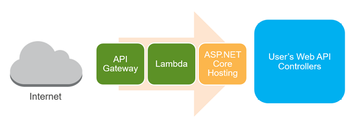


# Creating a Serverless Application with ASP.NET Core, AWS Lambda and AWS API Gateway

{{ page.date | date_to_string }} read



This blog post I will show a serverless programming model. Instead of using just plain .NET Core, I’ll be using ASP.NET Core with AWS Lambda.

Remember that for a typical ASP.NET Core application, a request to your website will go through IIS/Nginx, then Kestrel, and finally will be passed on to ASP.NET Core:



In the case of an ASP.NET Core Serverless application however, this is a bit different. The request will come in through API Gateway, which will pass it on to Lambda, which in turn will pass it on to ASP.NET Core:



## Overview of the application

Lets put together a simple Web API with a couple of endpoints which can be called from any client application. The API I’ll create will then do some actions in aws rds aurora instance. 

There will be 3 endpoints:

1.  The first endpoint will be at `/` and will return "Hello World".
2.  The second endpoint will return hello and the person name, and the endpoint will accept a request in the format `/{name}` where `name` is the person's name.
3.  The second endpoint will return a straight forward POST which write to the database and returns "Done" when it's finished.

## Create the project

Before creating the application, ensure you have downloaded and installed the [Preview of the AWS Toolkit for Visual Studio 2017](https://aws.amazon.com/blogs/developer/preview-of-the-aws-toolkit-for-visual-studio-2017/).

Inside Visual Studio, create a new project and select the **AWS Serverless Application (.NET Core)** template.

Next select the **ASP.NET Core Web API** blueprint.

## Some cleanup first

The project created from the template will contain a lot of extra stuff which is not needed in for this application, most notably `ValuesController` and `S3ProxyController` classes in the `Controllers` folder. Go ahead and delete the files for those classes.

It will also add some unneeded entries in the `serverless.template` file. Get rid of all of the entries related to S3, after which you should be left with a file that looks like the following:

```
{
  "AWSTemplateFormatVersion" : "2010-09-09",
  "Transform" : "AWS::Serverless-2016-10-31",
  "Description" : "An AWS Serverless Application that uses the ASP.NET Core framework running in Amazon Lambda.",
  "Parameters" : {
  },
  "Conditions" : {
  },
  "Resources" : {
    "Get" : {
      "Type" : "AWS::Serverless::Function",
      "Properties": {
        "Handler": "TimeZoneService::TimeZoneService.LambdaEntryPoint::FunctionHandlerAsync",
        "Runtime": "dotnetcore1.0",
        "CodeUri": "",
        "MemorySize": 256,
        "Timeout": 60,
        "Role": null,
        "Policies": [ "AWSLambdaFullAccess" ],
        "Environment" : {
          "Variables" : {
          }
        },
        "Events": {
          "PutResource": {
            "Type": "Api",
            "Properties": {
              "Path": "/{proxy+}",
              "Method": "ANY"
            }
          }
        }
      }
    }
  },
  "Outputs" : {
  }
}
```

## Setup the web api 

PLEASE NOTE: The RDS db is already created and has the relevant tables.

Create a new MVC Controller called `HomeController` and decorate it with the attribute `[Route("/")]`. This will ensure that the controller actions will be available at the route with the same name as the controllers - in this case `/`.

Create your entity framework DB context class.

```
    public partial class RDSContext : DbContext
    {
        public DbSet<Info> Infos { get; set; }

        public DbSet<User> Users { get; set; }

        protected override void OnConfiguring(DbContextOptionsBuilder optionsBuilder)
            => optionsBuilder.UseMySql(Helpers.GetRDSConnectionString());
    }
```


Create a model classes called `Infos`. This is the class which will contain the information we want to save. `User` which will save the user information.

```
    public class Info
    {
        public Guid Id { get; set; }

        [MaxLength(32)]
        public string Title { get; set; }

        [ForeignKey("User")]
        public int UserId { get; set; }

        public virtual User User { get; set; }

        public string Content { get; set; }

        public string Tags { get; set; }
    }
```

```
    public class User
    {
        public int UserId { get; set; }

        [MaxLength(64)]
        public string Name { get; set; }
    }
```

Now all that is left for us to do is to write the controller action which will implement our basic GET and POST functions:

```
[Route("/")]
    public class HomeController : Controller
    {
        // GET /
        [HttpGet]
        public JsonResult Get()
        {
            return new JsonResult("Hello World");
        }

        // GET /{name}
        [HttpGet("{name}")]
        public JsonResult Get([FromRoute] string name)
        {
            return new JsonResult($"Hello {name}");
        }

        // POST /bluePill
        [Route("/bluePill")]
        [HttpPost]
        public JsonResult Post()
        {
            using (var context = new RDSContext())
            {
                // Create database
                context.Database.EnsureCreated();

                // Init sample data
                var user = new User { Name = "Yuuko" };
                context.Add(user);
                var blog1 = new Blog
                {
                    Title = "Title #1",
                    UserId = user.UserId,
                    Tags = "ASP.NET Core, MySQL, Pomelo"
                };
                context.Add(blog1);
                var blog2 = new Blog
                {
                    Title = "Title #2",
                    UserId = user.UserId,
                    Tags = "ASP.NET Core, MySQL"
                };
                context.Add(blog2);
                context.SaveChanges();

                // Output data
                return new JsonResult("Done");
            }
        }
    }
```

## Local and Lambda entry points

Testing an ASP.NET Core Lambda Serverless application is a major plus point for me over the normal .NET Lambda Serverless application. With the normal application you actually have to deploy the application to AWS to be able to test it. With and ASP.NET Core Lambda Serverless application however, you can run the application locally as you would with any normal ASP.NET Core application.

The reason for this is because the ASP.NET Core serverless application contains a class called `LocalEntryPoint` which does the same bootstrapping of the hosting environment [as a normal ASP.NET Core application would do](https://docs.microsoft.com/en-us/aspnet/core/fundamentals/hosting):

```

    public class LocalEntryPoint
    {
        public static void Main(string[] args)
        {
            var host = new WebHostBuilder()
                .UseKestrel()
                .UseContentRoot(Directory.GetCurrentDirectory())
                .UseIISIntegration()
                .UseStartup<Startup>()
                .Build();

            host.Run();
        }
    }

```

However it also contains a second entry point called `LambdaEntryPoint`:

```

    public class LambdaEntryPoint : Amazon.Lambda.AspNetCoreServer.APIGatewayProxyFunction
    {
        protected override void Init(IWebHostBuilder builder)
        {
            builder
                .UseContentRoot(Directory.GetCurrentDirectory())
                .UseStartup<Startup>()
                .UseApiGateway();
        }
    }

```

This class is configured inside the `serverless.template` as the handler for all traffic coming through API Gateway.

```

{
  "AWSTemplateFormatVersion" : "2010-09-09",
  "Transform" : "AWS::Serverless-2016-10-31",
  "Description" : "POC serverless application to interact with aws aurora. A simple backend (read/write to auroraDB) with a RESTful API endpoint using Amazon API Gateway.",

  "Parameters" : {
  },

    "Conditions" : {
  },

  "Resources" : {
    "ServerlessApi":{
      "Type": "AWS::Serverless::Api",
      "Properties":{
        "StageName": "beta",
        "DefinitionUri": [SWAGGER FILE FROM S3 BUCKET]
      }
    },

    "AurorameLambda" : {
          "Type" : "AWS::Serverless::Function",
          "Properties": {
            "FunctionName": "aurorame",
            "Handler": "Serverless::Serverless.LambdaEntryPoint::FunctionHandlerAsync",
            "Runtime": "dotnetcore1.0",
            "CodeUri": "",
            "MemorySize": 512,
            "Timeout": 20,
            "Environment": {        
              "Variables": {"RDS_HOSTNAME": [YOUR RDS ARN]}
            },
            "Role": [YOUR ARN FOR THE ROLE EXCUTING LAMBDA],
            "VpcConfig":{
                           "SecurityGroupIds" : [ [YOUR ID] ],
                           "SubnetIds" : [ [LIST OF SUBNET IDS] ]
            },
            "Events": {
              "PutResource": {
                "Type": "Api",
                "Properties": {
                  "Path": "/{proxy+}",
                  "Method": "ANY",
                  "RestApiId":{ "Ref":"ServerlessApi"}
                }
              }
            }
          }
        },
        
        "LambdaPermission": {
          "Type": "AWS::Lambda::Permission",
          "Properties": {
            "Action": "lambda:invokeFunction",
            "FunctionName": {"Fn::GetAtt": ["AurorameLambda", "Arn"]},
            "Principal": "apigateway.amazonaws.com",
            "SourceArn": {"Fn::Join": ["", ["arn:aws:execute-api:", {"Ref": "AWS::Region"}, ":", {"Ref": "AWS::AccountId"}, ":", {"Ref": "ServerlessApi"}, "/*"]]}
          }
        }
  },

  "Outputs" : {
    "RootUrl": {
      "Description": "Root URL of the API gateway",
      "Value": {"Fn::Join": ["", ["https://", {"Ref": "ServerlessApi"}, ".execute-api.", {"Ref": "AWS::Region"}, ".amazonaws.com"]]}
    }
  }
}

```

## Let's take a look at the resources section of the template
- ServerlessApi defines the api to be created in api gateway for proxing requests to the lambda function.
- AurorameLambda is the definition of your lambda function and the events that it will handle for the api.
- LambdaPermission is the definition of the permission require for the api to execute the lamdba function  

See that `<span class="p">{</span><span class="err">proxy+</span><span class="p">}</span>` in the path? This means that this function handler is configured as a [Proxy Resource](http://docs.aws.amazon.com/apigateway/latest/developerguide/api-gateway-set-up-simple-proxy.html), and all traffic coming in on that path will be sent on to the `FunctionHandlerAsync` method. This particular method exists on the `APIGatewayProxyFunction` base class, and is part of the [AWS Lambda for .NET Core](https://github.com/aws/aws-lambda-dotnet) library.

You can go and have a look at [the source code for that function](https://github.com/aws/aws-lambda-dotnet/blob/f1eb9b067b5b6a5a5dde9284b42762ec4606390f/Libraries/src/Amazon.Lambda.AspNetCoreServer/APIGatewayProxyFunction.cs#L117-L131), but what it essentially does is to marshall the request coming in from API Gateway to the ASP.NET Core pipeline. From that point the normal ASP.NET Core pipeline takes over and you have all the greatness that comes with that: routing, model binding, etc…

Oh and did I mention that you can test and debug locally? So let’s do that by running the application…

## Testing the application

Once the application is running you can open [Postman](https://www.getpostman.com/) and make a request to `http://localhost:5000/` and you will see returned:

```
"Hello World"
```

## Return a named greeting

Next up, let’s create a controller action that will return a named greeting. For this method we will be passed in a route parameter called `name` which will contain the time zone ID you want to retrieve. This parameter will be something like `/neo`.

Here is the code for the action:

```
    // GET /{name}
    [HttpGet("{name}")]
    public JsonResult Get([FromRoute] string name)
    {
        return new JsonResult($"Hello {name}");
    }
```

Once again, let’s fire up the application and hit that endpoint in Postman.

## Return when data is written to the database

Next up, let’s create a controller action that will write some data to our database. For this method we will use the route `/neo`.

Here is the code for the action:

```
    // POST /bluePill
    [Route("/bluePill")]
    [HttpPost]
    public JsonResult Post()
    {
        using (var context = new RDSContext())
        {
            // Create database
            context.Database.EnsureCreated();

            // Init sample data
            var user = new User { Name = "Yuuko" };
            context.Add(user);
            var info1 = new Info
            {
                Title = "Title #1",
                UserId = user.UserId,
                Tags = "ASP.NET Core, MySQL, Pomelo"
            };
            context.Add(info1);
            var info2 = new Info
            {
                Title = "Title #2",
                UserId = user.UserId,
                Tags = "ASP.NET Core, MySQL"
            };
            context.Add(info2);
            context.SaveChanges();

            // Output data
            return new JsonResult("Done");
        }
    }
```

Once again, let’s fire up the application and hit that endpoint in Postman.

## Deploying to AWS

The last bit I want to demonstrate is how to deploy the project to Lambda. For this am using the command line:

Restore dependencies
```
    cd "Serverless"
    dotnet restore
```

Deploy application
```
    cd "Serverless"
    dotnet lambda deploy-serverless
```

Once the project has been deployed, the URL for your serverless app will be displayed on the command line

Once again we can use Postman to test our API. Go to that URL and append `/neo` to access the endpoint to retrieve named greeting, `/bluePill` for writing data to our RDS instance.

---

Return to [Blogs](../index.md).

