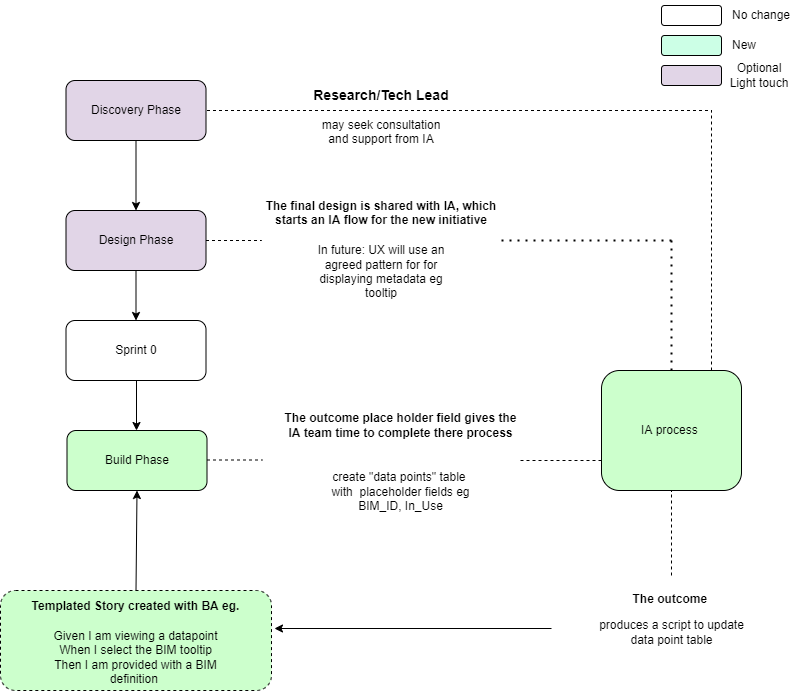
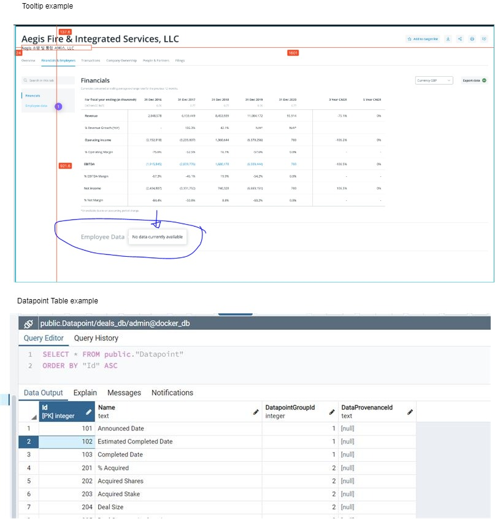

# BIM process
## What is the problem we are trying to solve?

Today we dont have a comphensive definition for our data points aka no data catalogue.

There is not pattern to surface or save the metadata info for datapoints

[More...](https://preqincom.sharepoint.com/sites/DataGovernanceAuditControls/SitePages/Information-Architecture--What-does-it-mean-for-you-.aspx?OR=Teams-HL&CT=1642586030750&sourceId=&params=%7B%22AppName%22%3A%22Teams-Desktop%22%2C%22AppVersion%22%3A%2227%2F21110108720%22%7D)

----

## What are the outcomes?

- **BIM classification of data points, taxtonomies and business rules**
- **Complete and automated data dictionary**
- **Support IA process and deliverrables**
- **Have a pattern than is easy to implement for the CFTs**
- **Ability to ingest and derive analytic insights**
- **Ability to "self-serve" removes dependencies**
- **Minimal change to the current delivery process buy using a Templated story for the team to implement**

## Proposal

The best way to avoid dependency is not to have them in the first place!

---

---
### Appendix

#### Roles

The **Research Lead** in each CFT is responsible for advocating for and owning the entire spectrum of research requirements, including that we use the correct terminology, rules and relationships for the data entities we create.

The **Product Lead** is responsible for gathering user and research requirements from stakeholders and is accountable for the final definition of and prioritsation of all requirements that will move to the design and technology leads.

#### Examples

