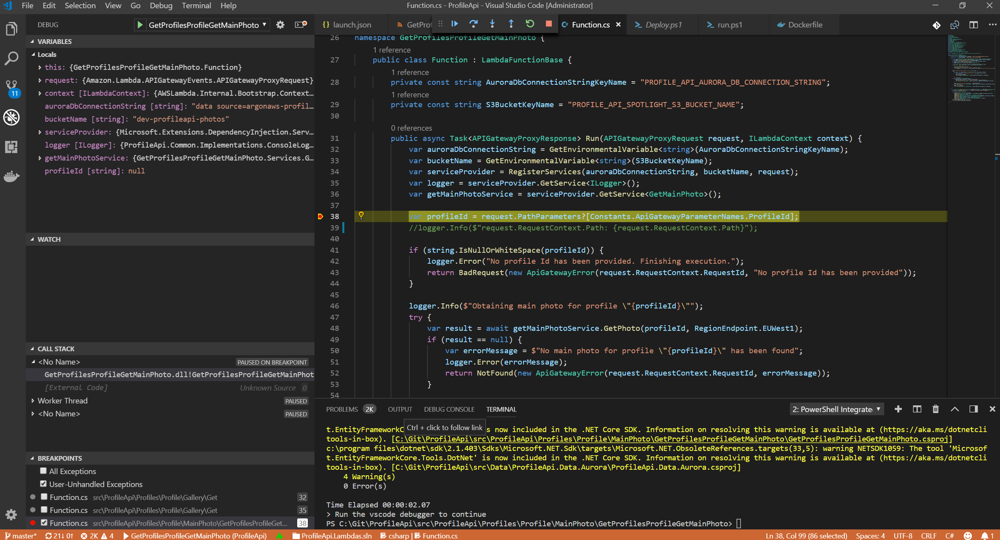




# Debugging AWS Lambda using VsCode

{{ page.date | date_to_string }} 



## Why

Debugging aws lambda can be quite tricky. You have the option of using the console or as explained below through docker debugging on [VsCode](https://code.visualstudio.com/).

## Prerequisites

### Installing Docker

Docker is an open-source software container platform that allows you to build, manage and test applications, whether you're running on Linux, Mac or Windows. For more information and download instructions, see Docker.

Once you have Docker installed, SAM CLI automatically provides a customized Docker image called docker-lambda. This image is designed specifically by an AWS partner to simulate the live AWS Lambda execution environment. This environment includes installed software, libraries, security permissions, environment variables, and other features outlined at Lambda Execution Environment and Available Libraries.

Using docker-lambda, you can invoke your Lambda function locally. In this environment, your serverless applications execute and perform much as in the AWS Lambda runtime, without your having to redeploy the runtime. Their execution and performance in this environment reflect such considerations as timeouts and memory use.

## Info

This steps are to test dotnet core 2.0/2.1 debugging within the lambda dotnet runtime docker container.

### Description

This project utilized the container images from the [lambci/docker-lambda] (https://github.com/lambci/docker-lambda/tree/master/examples/dotnetcore2.1) project as well as the sample code and vscode launch configuration from the [sleemer/docker.dotnet.debug](https://github.com/sleemer/docker.dotnet.debug) project.

The __lambci/lambda:dotnetcore2.1__ container image was modified to include VSDBG, the dotnet core debugger. Furthermore, the entrypoint was changed to wait for a debugger to attach to the container.

The vscode launch configuration was modified to use the `pipeTransport` protocol to communicate with VSDBG in the docker container and run the lambda bootstrapper, __MockBootstraps.dll__.

- launch.json

The args contains the handler to be launched by vscode as the first parameter followed by another object describe as json.

```json
{
    "version": "0.2.0",
    "configurations": [
        {
            "name": ".NET Core Docker Launch (console)",
            "type": "coreclr",
            "request": "launch",
            "program": "/var/runtime/MockBootstraps.dll",
            "args": [
                "test::test.Function::FunctionHandler",
                "{\"foo\":\"bar\"}"
            ],
            "cwd": "/var/task",
            "sourceFileMap": {
                "/var/task": "${workspaceRoot}"
            },
            "logging": {
                "engineLogging": true,
                "exceptions": true,
                "moduleLoad": true,
                "programOutput": true
            },
            "pipeTransport": {
                "pipeProgram": "docker",
                "pipeCwd": "${workspaceRoot}",
                "pipeArgs": [
                    "exec",
                    "-i",
                    "lambda_dotnetcore2.1"
                ],
                "quoteArgs": false,
                "debuggerPath": "/vsdbg/vsdbg"
            },
            "justMyCode": true
        }
```

- Dockerfile

The docker file add vsdbg to the image and the sleep for debugging.

```dockerfile

FROM lambci/lambda:dotnetcore2.1

# Add in VSDBG
# Based on https://github.com/sleemer/docker.dotnet.debug
ENV NUGET_XMLDOC_MODE skip
WORKDIR /vsdbg
RUN yum update \
    && yum install -y unzip \
    && curl -sSL https://aka.ms/getvsdbgsh | bash /dev/stdin -v latest -l /vsdbg

# Sleep until a debugger is attached
ENTRYPOINT ["/bin/bash", "-c", "sleep infinity"]

```

- Run Script

```powershell

$name = "lambda_dotnetcore2.1"
$projpath = Get-Location
$config = "Debug"
$publish = "bin\Debug\netcoreapp2.1\publish"
$me = ($env:ComputerName).toLower()

# Clean up any existing build objects
Remove-Item bin -Recurse -Force -ErrorAction Ignore
Remove-Item obj -Recurse -Force -ErrorAction Ignore
Remove-Item $publish -Recurse -Force -ErrorAction Ignore

# Build the dotnet app dll and output to the pub folder
Write-Host "> Building csproj in container"
dotnet publish -c $config

# Build our lambda container with VSDBG installed based on lambci/lambda:dotnetcore2.1
Write-Host "> Building lambda dotnetcore2.1 container"
docker build -q -t "$me/lambda:dotnetcore2.1" .

# Kill running container if it exists
$id = docker ps --filter "name=$name"
if ($id) {
  Write-Host "> Cleaning up existing lambda dotnetcore2.1 container"
  docker kill $id
}

# Start our custom lambda container as a detached process
# Note: The container will start and wait until a debugger is attached
Write-Host "> Running lambda dotnetcore2.1 container"
docker run --name $name -d --rm -v "${projpath}\${publish}:/var/task" "$me/lambda:dotnetcore2.1"

# Build locally for syntax highlighting
Write-Host "> Building csproj locally"
dotnet build -c Debug -v quiet

Write-Host "> Run the vscode debugger to continue"

```

- Setup & Run

```powershell

docker pull lambci/lambda:dotnetcore2.1
.\run.ps1

```

- Set a breakpoint in Function.cs
- Run the vscode _.NET Core Docker Launch (console)_ launch task (F5)

- Screenshots



Et Voila!
---

Return to [Blogs](../index.md).